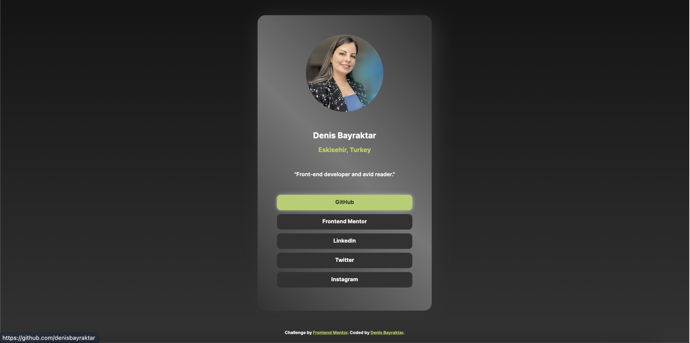

# Frontend Mentor - Social links profile solution

This is a solution to the [Social links profile challenge on Frontend Mentor]. 

### Screenshot

### Links

- Live Site URL: [Add live site URL here](https://your-live-site-url.com)

### Built with

- Semantic HTML5 markup
- CSS custom properties
- Flexbox
- CSS Grid
- Mobile-first workflow
- [Styled Components](https://styled-components.com/) - For styles

### What I learned

While working on this project, I grasped a number of important concepts and honed my skills:

- Creating Buttons and Adding Links: I added buttons to the page using HTML and CSS, and linked them to websites.

- Customizing Button Styles: I customized the appearance and behavior of buttons using CSS, adding hover effects and color changes when hovering over them.

- Editing Link Styles: I improved the user experience by removing the underline from links and adding color changes when hovering over them.

- Adding Gradient Background: By using CSS, I added gradient to the background, making the page more visually appealing.

Acquiring these skills has helped me successfully complete the project and enhance my abilities in web design.

## Author

- Frontend Mentor - [@denisbayraktar](https://www.frontendmentor.io/profile/denisbayraktar)
- LinkedIn - [@denisbayraktar](https://www.linkedin.com/in/denisbayraktar/)

